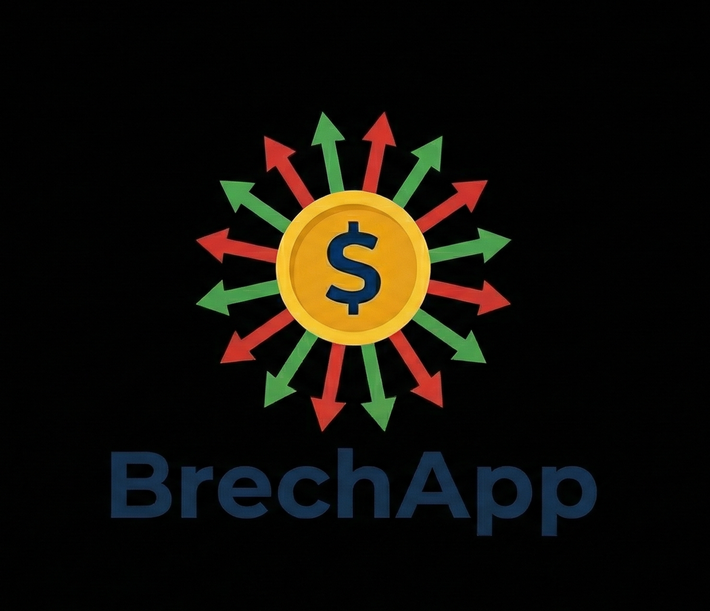

# BrechApp 🇦🇷💵



**BrechApp** es una plataforma completa para el análisis y predicción del mercado cambiario argentino, especializada en el seguimiento de la brecha cambiaria y predicción del dólar en sus diferentes modalidades (oficial, blue, MEP, CCL).

## 🌐 Aplicación en Vivo

**🚀 Accede a la aplicación:** [https://brechapp.streamlit.app/](https://brechapp.streamlit.app/)

## 📋 Descripción

Este proyecto integra modelos de series temporales (ARIMA, LightGBM, Ensemble) con una interfaz web interactiva para:
- Monitoreo en tiempo real de cotizaciones del dólar argentino
- Predicción de precios del dólar blue
- Análisis de volatilidad y spreads cambiarios
- Visualización de datos históricos y tendencias
- Comparación entre diferentes tipos de cambio

## 🏗️ Estructura del Proyecto

```
BrechApp/
├── src/
│   ├── ingestion/      # Recolección de datos
│   ├── processing/     # Limpieza y transformación
│   ├── analysis/       # Análisis exploratorio
│   ├── models/         # Modelos de ML (ARIMA, Prophet, GARCH)
│   ├── api/            # Backend FastAPI
│   └── frontend/       # Frontend Streamlit
├── data/
│   ├── raw/            # Datos crudos
│   └── processed/      # Datos procesados
├── notebooks/          # Análisis exploratorio
├── tests/              # Tests unitarios
└── docs/               # Documentación
```

## 🔧 Requisitos

- Python 3.8+
- pip
- Git

## 🚀 Instalación

### 1. Clonar el Repositorio

```bash
# Clonar el repositorio
git clone https://github.com/Davoassassin27/BrechApp.git
cd BrechApp

# Ver todas las ramas disponibles
git branch -a
```

### 2. Elegir la Rama de Trabajo

```bash
# Para trabajar con todo (recomendado)
git checkout develop

# O elegir una feature específica:
git checkout feature/models      # Solo modelos
git checkout feature/api         # Solo API
git checkout feature/frontend    # Solo frontend
```

### 3. Configurar Entorno Virtual

**Windows (PowerShell):**
```powershell
# Crear entorno virtual
python -m venv .venv

# Activar entorno
.\.venv\Scripts\Activate.ps1

# Si hay error de permisos, ejecutar:
Set-ExecutionPolicy -ExecutionPolicy RemoteSigned -Scope CurrentUser
```

**Linux/Mac:**
```bash
# Crear entorno virtual
python3 -m venv .venv

# Activar entorno
source .venv/bin/activate
```

### 4. Instalar Dependencias

```bash
# Actualizar pip
pip install --upgrade pip

# Instalar dependencias
pip install -r requirements.txt
```

## 📊 Uso

### Ingesta de Datos

```bash
# Descargar datos históricos
python src/ingestion/ingest_history.py
```

### Procesamiento

```bash
# Procesar datos a formato Parquet
python src/processing/process_history.py
```

### Ejecutar Frontend (Streamlit)

```bash
# Iniciar aplicación web
streamlit run src/frontend/app.py

# La app se abrirá en: http://localhost:8501
```

### Ejecutar API (FastAPI)

```bash
# Iniciar servidor API
uvicorn src.api.main:app --reload

# Documentación disponible en:
# - Swagger UI: http://localhost:8000/docs
# - ReDoc: http://localhost:8000/redoc
```

### Análisis en Notebooks

```bash
# Iniciar Jupyter
jupyter notebook

# Abrir notebooks/03_final_analysis.ipynb
```

## 🧪 Testing

```bash
# Ejecutar todos los tests
pytest

# Con cobertura
pytest --cov=src tests/

# Test específico
pytest tests/test_models.py
```

## 🌿 Workflow Git

```bash
# Actualizar desde develop
git checkout develop
git pull origin develop

# Crear nueva feature
git checkout -b feature/mi-feature

# Hacer cambios y commit
git add .
git commit -m "feat: descripción del cambio"

# Push a GitHub
git push -u origin feature/mi-feature
```

## 📦 Ramas Disponibles

- `main` - Producción estable
- `develop` - Desarrollo principal
- `feature/models` - Modelos de ML
- `feature/api` - Backend API
- `feature/frontend` - Interfaz web

## 🛠️ Tecnologías

- **Data Processing**: Pandas, Polars, NumPy, PyArrow
- **ML Models**: Statsmodels (ARIMA), LightGBM, Prophet, ARCH (GARCH)
- **Ensemble Methods**: Weighted Average, Stacking
- **API**: FastAPI, Uvicorn, Pydantic
- **Frontend**: Streamlit, Plotly
- **Data Source**: DolarAPI (https://dolarapi.com/)
- **Testing**: Pytest
- **Deployment**: Streamlit Cloud

## 📊 Modelos Implementados

### Modelos Base
- **ARIMA**: Modelo autorregresivo integrado de medias móviles para series temporales
- **LightGBM**: Gradient Boosting optimizado para predicción de precios
- **GARCH**: Modelado de volatilidad condicional

### Ensemble
- **Weighted Average**: Combinación ponderada de predicciones
- **Stacking**: Meta-modelo que aprende de las predicciones base

## 📝 Notas

- Los datos se almacenan en `data/` (ignorado por git)
- Configurar variables de entorno en `.env` si es necesario
- La API corre en puerto 8000 por defecto
- Streamlit corre en puerto 8501 por defecto

## 🤝 Contribuir

1. Fork el proyecto
2. Crear rama feature (`git checkout -b feature/AmazingFeature`)
3. Commit cambios (`git commit -m 'Add: AmazingFeature'`)
4. Push a la rama (`git push origin feature/AmazingFeature`)
5. Abrir Pull Request

## 📄 Licencia

Este proyecto es de código abierto.

## 👥 Autor

**David Soler**
Desarrollador y Data Scientist
Proyecto académico - UCASAL 2025

## 📚 Documentación Adicional

- [Plan de Modelado](docs/MODEL_PLAN.md)
- [Informe Ejecutivo](docs/Informe_BrechApp_MyS.md)
- [Notebooks de Análisis](notebooks/)